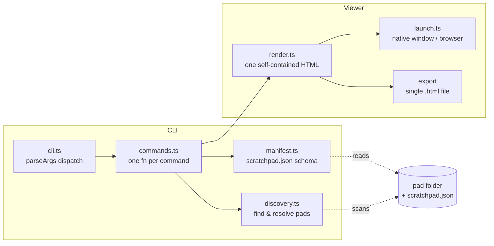
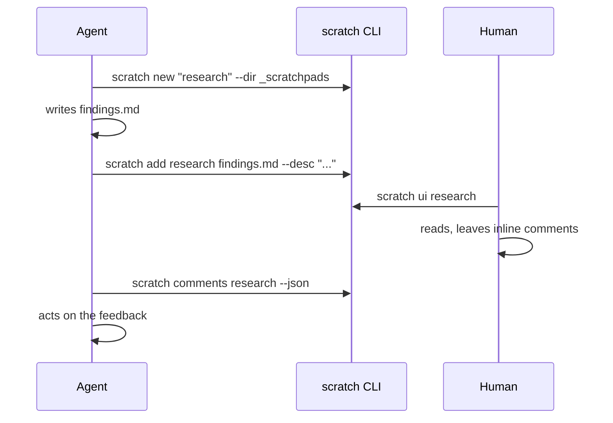

# Mermaid diagrams

Any fenced block tagged `mermaid` renders as a diagram. Here is scratch's own architecture:

```mermaid
flowchart LR
    subgraph CLI
        cli[cli.ts<br/>parseArgs dispatch] --> cmds[commands.ts<br/>one fn per command]
        cmds --> disc[discovery.ts<br/>find & resolve pads]
        cmds --> man[manifest.ts<br/>scratchpad.json schema]
    end
    subgraph Viewer
        render[render.ts<br/>one self-contained HTML] --> launch[launch.ts<br/>native window / browser]
        render --> export[export<br/>single .html file]
    end
    cmds --> render
    man -.reads.-> pad[(pad folder<br/>+ scratchpad.json)]
    disc -.scans.-> pad
```

And a sequence diagram of the agent loop:

```mermaid
sequenceDiagram
    participant A as Agent
    participant S as scratch CLI
    participant H as Human
    A->>S: scratch new "research" --dir _scratchpads
    A->>A: writes findings.md
    A->>S: scratch add research findings.md --desc "..."
    H->>S: scratch ui research
    H->>H: reads, leaves inline comments
    A->>S: scratch comments research --json
    A->>A: acts on the feedback
```
