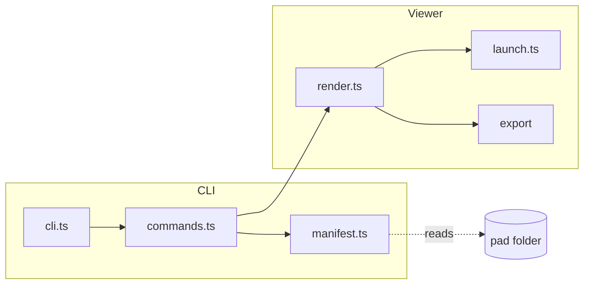
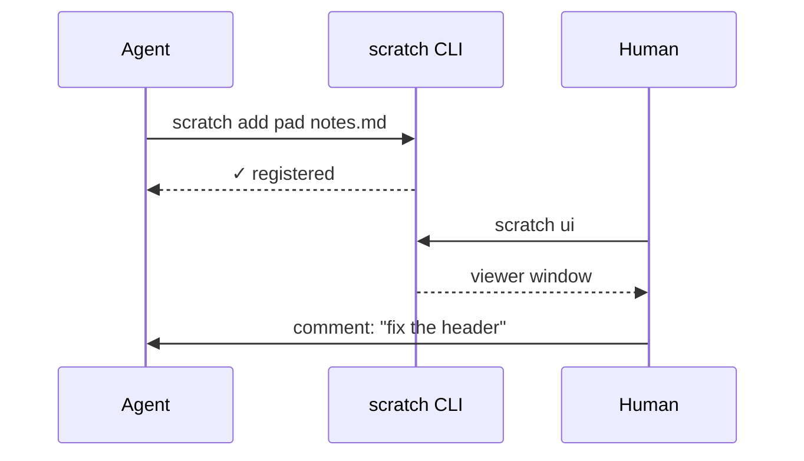
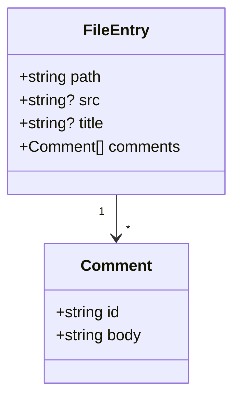
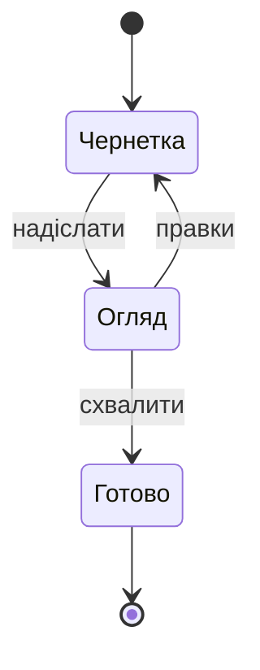

# Diagrams

## Flowchart with subgraphs

```mermaid
flowchart LR
  subgraph CLI
    cli[cli.ts] --> cmd[commands.ts] --> man[manifest.ts]
  end
  subgraph Viewer
    render[render.ts] --> launch[launch.ts]
    render --> export[export]
  end
  cmd --> render
  man -.reads.-> pad[(pad folder)]
```

## Sequence

```mermaid
sequenceDiagram
  participant A as Agent
  participant S as scratch CLI
  participant H as Human
  A->>S: scratch add pad notes.md
  S-->>A: ✓ registered
  H->>S: scratch ui
  S-->>H: viewer window
  H->>A: comment: "fix the header"
```

## Class

```mermaid
classDiagram
  class FileEntry {
    +string path
    +string? src
    +string? title
    +Comment[] comments
  }
  class Comment {
    +string id
    +string body
  }
  FileEntry "1" --> "*" Comment
```

## State with Cyrillic labels

```mermaid
stateDiagram-v2
  [*] --> Чернетка
  Чернетка --> Огляд: надіслати
  Огляд --> Готово: схвалити
  Огляд --> Чернетка: правки
  Готово --> [*]
```
